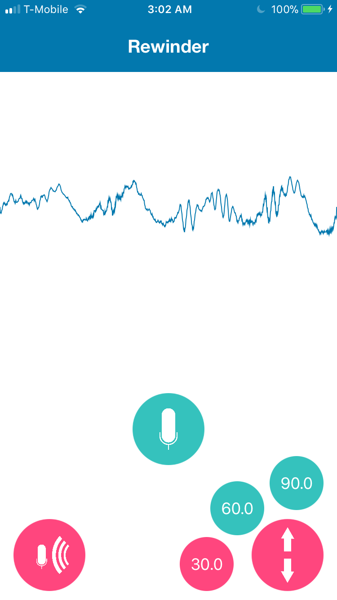

# Hello, I'm Crossley
  

**I am a iOS Developer working on a startup which releases apps for the iOS app store.**

## Current iOS Projects
- **Articulate** - an app to learn new words.

## Released iOS apps to app store

- [**Tic Tac Toe - Unbeatable AI**](https://apps.apple.com/us/app/tic-tac-toe-unbeatable-ai/id6474344689)  - A two player 3x3 grid board game with player vs. player and player vs. AI. [Check it out in the app store](https://apps.apple.com/us/app/tic-tac-toe-unbeatable-ai/id6474344689) or [the github repository](https://github.com/crozario/TicTacToe).

- [**Rewinder: Rewind It**](https://github.com/crozario/Rewinder) (Discontinued) - an audio recording app to easily retrieve the past 30, 60 or 90 seconds of recording. [Check out the github repository.](https://github.com/crozario/Rewinder)

    
      

## Other Projects

- [**Impressionist**](https://www.youtube.com/watch?v=zj1XErgDqNI) - A Netflix chrome extension for voice acting characters from tv shows and movies. [Watch the youtube demo](https://www.youtube.com/watch?v=zj1XErgDqNI) or [check out the github repository](https://github.com/crozario/Impressionist).

## Achievements
- [Won Google Techmaker Best Accessibility Hack at HackTCNJ 2018 for Rewinder.](https://devpost.com/software/rewinder-oxp13n)