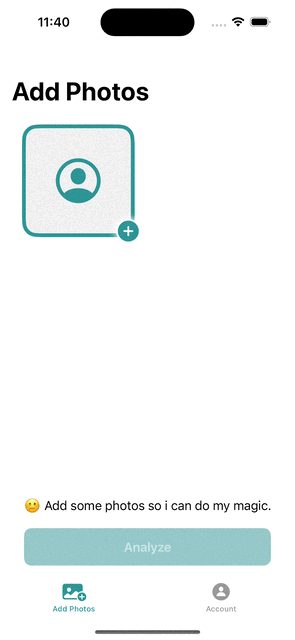

# Hello, I'm Crossley
  

    
    
    
    
    

## Projects
- **Date Ready** - an app to help improve dating profiles. It is currently able to review profile images. We process images using gpt4 vision api. Future updates will include enhancing images, editing images, help users chat with their matches.
- **Articulate** - an app for learning new words.
- [**Tic Tac Toe - Unbeatable AI**](https://apps.apple.com/us/app/tic-tac-toe-unbeatable-ai/id6474344689)  - A two player 3x3 grid board game with player vs. player and player vs. AI.
- [**Rewinder: Rewind It**](https://github.com/crozario/Rewinder) (Discontinued) - an audio recording app to easily retrieve the past 30, 60 or 90 seconds of recording. [Check out the github repository.](https://github.com/crozario/Rewinder)
- [**Solar System Demo**](https://github.com/crozario/SolarSystemDemo) - displays objects from the solar system. Used Spline for displaying interactive 3D objects.
- [**Dog Demo**](https://github.com/crozario/dogdemo) - shows random dog images using a public api.
- [**Impressionist**](https://www.youtube.com/watch?v=zj1XErgDqNI) - A Netflix chrome extension for voice acting characters from tv shows and movies. [Watch the youtube demo](https://www.youtube.com/watch?v=zj1XErgDqNI) or [check out the github repository](https://github.com/crozario/Impressionist).

## Achievements
- [Won Google Techmaker Best Accessibility Hack at HackTCNJ 2018 for Rewinder.](https://devpost.com/software/rewinder-oxp13n)
